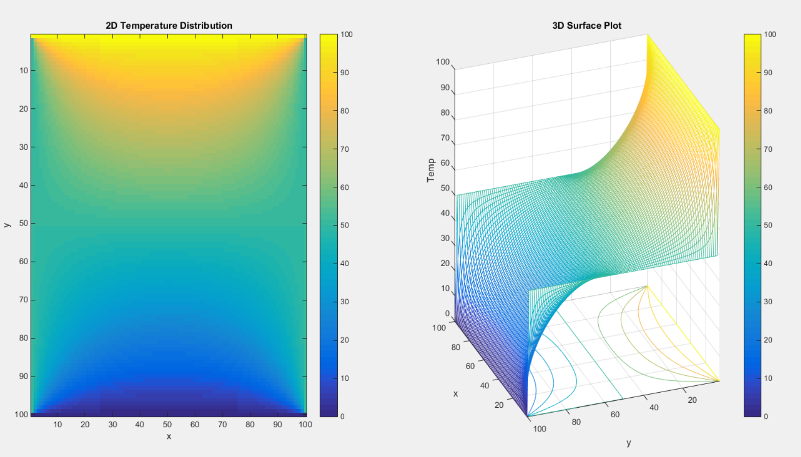

# 2D Steady-State Heat Equation Solver (Laplace Equation)

This repository contains a MATLAB function, `HeatDist.m`, designed to calculate the steady-state temperature distribution across a 2D square plate given specific constant temperatures at its boundaries (Dirichlet boundary conditions).

### Physical and Mathematical Background
The physical phenomenon of steady-state heat conduction in two dimensions without internal heat generation is governed by Laplace's equation. The core principle dictates that the system seeks thermal equilibrium, meaning the temperature at any internal point eventually becomes the exact average of the temperatures of its surrounding neighbors.

### Methodology
The function utilizes the Finite Difference Method (FDM) to translate the continuous partial differential equation into a discrete numerical grid. To solve the resulting system of linear equations, it employs the Gauss-Seidel iterative method. The algorithm sweeps through the internal grid points, updating their temperatures continuously until the maximum difference between iterations drops below a strict tolerance of 1e-6, ensuring a precise convergence.

### Syntax and Usage
To use the function in MATLAB, call it with the following syntax:

T = HeatDist(N, T_top, T_bottom, T_left, T_right)

Inputs:
1- N : The number of grid points along one side (determines the resolution of the square grid).
2- T_top : Constant temperature at the top boundary.
3- T_bottom : Constant temperature at the bottom boundary.
4- T_left : Constant temperature at the left boundary.
5- T_right : Constant temperature at the right boundary.

Outputs:
1- T : A 2D matrix representing the calculated temperature at each grid point.
2- Visual Plots: The function automatically generates a figure containing a 2D Temperature Distribution (Heatmap) and a 3D Surface Plot.

### Example
To simulate a 50x50 grid with boundaries set to 100 at the top, 0 at the bottom, 75 at the left, and 50 at the right, you can run:

T = HeatDist(50, 100, 0, 50, 50);

