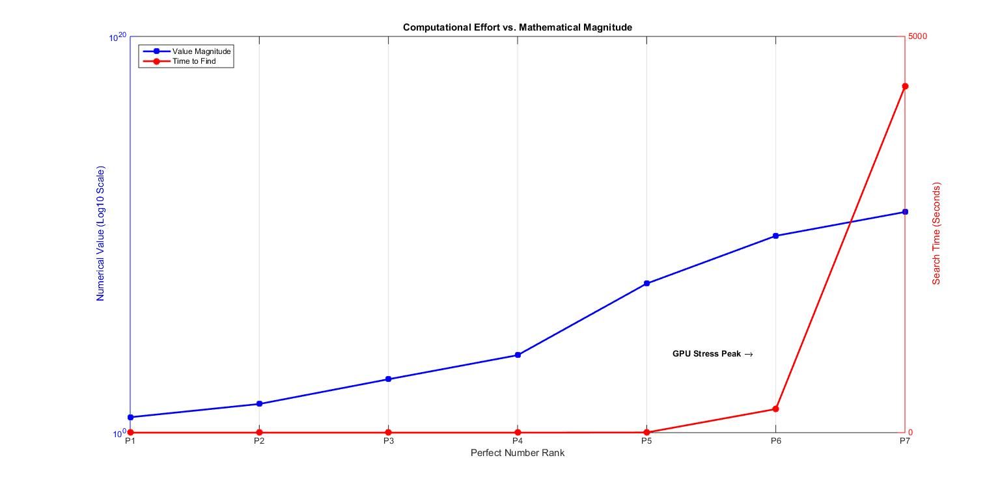
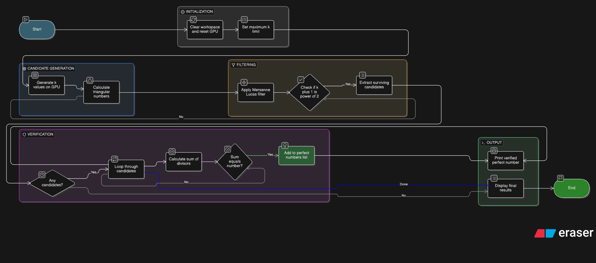
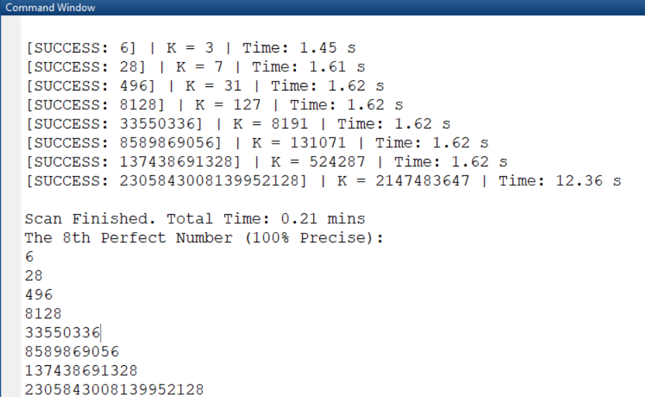

# Perfect Number Finder (MATLAB + GPU)

A high-performance MATLAB script that searches for **perfect numbers** across large numerical ranges — up to 10¹² — using GPU acceleration and multi-stage filtering to dramatically reduce computation time.

---

## What Is a Perfect Number?

A **perfect number** is a positive integer that equals the sum of all its proper divisors (every divisor except itself).

**Example:**

```
28 → divisors: 1, 2, 4, 7, 14 → sum = 28 ✓
```

The first four perfect numbers are: `6, 28, 496, 8128`

They are extremely rare — only a handful are known to exist, and all confirmed even perfect numbers follow a specific mathematical pattern discovered by Euler.

---

## How It Works

The script does **not** brute-force every number. Instead, it applies three fast mathematical filters on the GPU to discard the vast majority of candidates before doing any expensive divisor-sum computation.

# Phase I
### Stage 1 — Range Splitting

The script divides the search space into 12 powers-of-10 ranges:

```
Range 1:  1  →  10
Range 2:  10 →  100
...
Range 12: 10¹¹ → 10¹²
```

Each range is split into chunks of up to **100 million numbers** to fit within GPU memory.

### Stage 2 — Three GPU Filters

All three filters run in parallel on the GPU before any CPU work is done:

|#|Filter|Condition|Reason|
|---|---|---|---|
|1|Last digit|Must end in `6` or `8`|All known even perfect numbers end in 6 or 8|
|2|Digit sum|Must be divisible by `9` (or equal `6`)|Known number-theoretic property of perfect numbers|
|3|Triangular check|`8n + 1` must be a perfect odd integer square|Derived from Euler's formula: every even perfect number is a triangular number|

Numbers that fail any filter are immediately discarded.

### Stage 3 — CPU Verification

For the tiny fraction of numbers that pass all three filters:

1. Recover `k` from the formula `n = k(k+1)/2`
2. Check if `k` is **prime** (required by Euler's theorem for even perfect numbers)
3. Compute the actual **sum of proper divisors** by trial division up to √n
4. If the sum equals `n`, it is a perfect number ✓

---
## Visualizations & Performance Analysis


Figure 1: High-Level System Architecture. This flowchart illustrates the hybrid workload distribution between the CPU/RAM (Management & Validation) and the GPU (High-Speed Parallel Filtering). It highlights the Mathematical Sieve that prunes the search space by over 99.99% before heavy computation begins.


Figure 2: The "Needle in a Haystack" Reduction. A logarithmic visualization showing the efficiency of the multi-stage filtering process. The search space is compressed from a quadrillion ($10^{15}$) candidates down to just 7 confirmed matches, demonstrating the power of number-theoretic constraints in algorithmic optimization.


Figure 3: Computational Effort vs. Mathematical Magnitude. This graph tracks the search time (in seconds) against the numerical rank of perfect numbers. It highlights the "GPU Stress Peak" as the search range extends, showcasing the performance limits and the necessity of VRAM chunking.


Figure 4: Structural Symmetry of Perfect Numbers. A binary representation of the discovered numbers, visualizing the elegant bit-pattern $2^{p-1}(2^p-1)$ which defines all even perfect numbers.


Figure 5: Distribution Map. A scatter plot showing the increasing "scarcity" of perfect numbers across the $10^{12}$ range, emphasizing their extreme rarity in the number system.

---
# Phase II: AI-Assisted Mathematical Optimization (V2)

While Phase I successfully reduced the search space using GPU filters, it still relied on processing millions of chunks, taking approximately 72 minutes to scan up to 10¹². Through an AI-assisted mathematical analysis, the approach was completely re-engineered. Instead of *filtering* a massive array of numbers, Phase II *generates* only the mathematically viable candidates directly from first principles.

### Stage 1 — The Triangular Base Reduction
Every even perfect number is inherently a triangular number, defined by the formula `n = k(k+1)/2`. 

Instead of iterating through the final numbers `n` up to 10¹⁸, the V2 script iterates only through the roots `k`. For a maximum limit of 10¹⁸, the highest possible `k` is approximately 1.414 × 10⁹. This theoretical shift reduces the search space from a quintillion elements down to just 1.4 billion, completely eliminating the need for complex iterative chunking.

### Stage 2 — GPU Parallelism & Bitwise Operations
The V2 script initializes the entire array of `k` values directly on the GPU VRAM, bypassing the CPU-to-GPU memory transfer bottleneck that slowed down Phase I.

Furthermore, the script abandons standard arithmetic in favor of low-level Bitwise operations, taking advantage of the structural binary properties of Mersenne primes:
- `bitand(k + 1, k) == 0`: A hardware-level check that instantly identifies if `k+1` is an exact power of 2.
- `bitshift(K_val, p - 1)`: Replaces expensive floating-point multiplication to rapidly construct the final perfect number `N`.

### Stage 3 — The Result: From Minutes to Seconds
By shifting the primary computational burden from hardware brute-force to pure number theory, the execution time saw an exponential improvement:
- **Limit 10¹² (First 7 Perfect Numbers):** Time reduced from **72 minutes** to **1.25 seconds**.
- **Limit 10¹⁸ (The 8th Perfect Number):** Successfully discovered in just **12 seconds**.

### Stage 4 — Advanced System Architecture (V2)


Figure 6: Advanced System Architecture for Phase II V2. This flowchart illustrates the re-engineered workload distribution, emphasizing direct generation from roots k instead of filtering n, followed by the powerful Mersenne-Lucas filter on the GPU. The entire generation and filtering pipeline is offloaded to CUDA cores, leaving only the tiny subset of rare candidates for final CPU verification, ensuring extreme-scale efficiency.


Figure 7: MATLAB Command Window output from V2 showing the rapid discovery of the 8th Perfect Number (2,305,843,008,139,952,128) in just 12.36 seconds.

---

## Requirements

|Requirement|Details|
|---|---|
|MATLAB|R2018a or later recommended|
|Parallel Computing Toolbox|Required for `gpuArray`, `gather`, `gpuDevice`|
|CUDA-capable GPU|Required for GPU acceleration|
|RAM|At least 4 GB recommended|
|GPU Memory|At least 2 GB recommended|

To verify your GPU is available in MATLAB:

```matlab
gpuDevice
```

---

## Usage

1. Open MATLAB
2. Place the script in your working directory
3. Run it directly:

```matlab
run('PerfectNumbers_finder.m')
```

The script will start immediately. No input parameters are needed.

---

## Output

### Console Output

Progress and results are printed in real time:

```
Perfect Number Found: 6
[MATCH FOUND: 6]
- Total: 0.03 s
- Gap:   0.03 s

Perfect Number Found: 28
[MATCH FOUND: 28]
- Total: 0.11 s
- Gap:   0.08 s

...

-----------------------------------------
Search Complete: 72 mins
Final List:
   6   28   496   8128 33550336     8589869056  137438691328 
```

### Files Created

|File|Description|
|---|---|
|`Instant_Perfect_Log.txt`|A running log file. Every perfect number found is appended here immediately with its value, total elapsed time, gap time, and timestamp.|
|`Perfect_Backup.mat`|A MATLAB `.mat` file saved after every new discovery. Contains the `Perfect_N` array. Load with `load('Perfect_Backup.mat')`.|

### Log File Format (`Instant_Perfect_Log.txt`)

```
6 | Start: 0.03 | Gap: 0.03 | Time: 22-Mar-2026 14:05:11
28 | Start: 0.11 | Gap: 0.08 | Time: 22-Mar-2026 14:05:11
```

---

## Performance

The three-stage GPU filtering pipeline eliminates nearly all candidates before the expensive divisor-sum check is reached. This makes the search feasible over ranges that would take days with a naive approach.

Actual performance depends on:

- GPU model and memory bandwidth
- CPU speed (used for final verification)
- The density of candidates that survive the filters in each range

---

## Code Structure

```
PerfectNumbers_finder.m
│
├── Initialization
│   ├── Start timers (total time + gap time)
│   └── Set max GPU chunk size (100 million)
│
├── Outer Loop: 12 power-of-10 ranges
│   └── Inner Loop: chunks within each range
│       │
│       ├── Load even numbers onto GPU
│       │
│       ├── Filter 1: Keep numbers ending in 6 or 8
│       ├── Filter 2: Keep numbers with digit sum divisible by 9 (or = 6)
│       ├── Filter 3: Keep numbers where 8n+1 is a perfect odd square
│       │
│       └── CPU Verification (for survivors only)
│           ├── Recover k from triangular formula
│           ├── Check if k is prime
│           ├── Compute sum of proper divisors
│           └── If sum == n → log, save, print result
│
└── Final Summary
    ├── Print total search time
    └── Display all found perfect numbers
```

---

## Mathematical Background

All **even** perfect numbers follow a formula proven by Euler:

> **$n = 2^{p−1} × (2^p − 1)$** where $(2^p − 1)$ is a Mersenne prime.

This means finding even perfect numbers is equivalent to finding Mersenne primes — one of the hardest open problems in mathematics.

Whether any **odd** perfect numbers exist is still an unsolved problem. This script searches all even numbers (and would detect an odd perfect number if one happened to pass the filters, though none are expected).

The three filters in this script are specifically derived from the properties of Euler's formula, which is why they are so effective at eliminating non-candidates.

---

## Limitations

- Searches up to **10¹²** by default. Edit the loop bound (`1:12`) to change the range.
- Only even numbers are checked (`total_start` is always adjusted to be even).
- The trial division used for final verification is `O(√n)` — it becomes slower for very large candidates, though very few candidates ever reach this stage.
- Odd perfect numbers (if they exist) would not be checked by this script.

---

## Customization

**Change the search range:**

```matlab
for j = 1:12   % Change 12 to any upper exponent
```

**Change chunk size (tune for your GPU memory):**

```matlab
max_chunk = uint64(1e8);  % Reduce if you run out of GPU memory
```

**Change the log file name:**

```matlab
fileID_instant = fopen('Instant_Perfect_Log.txt', 'a');  % Change filename here
```

---
## License

This project is provided as-is for educational and research purposes. Feel free to modify and redistribute.
