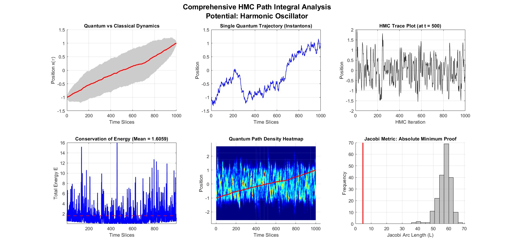
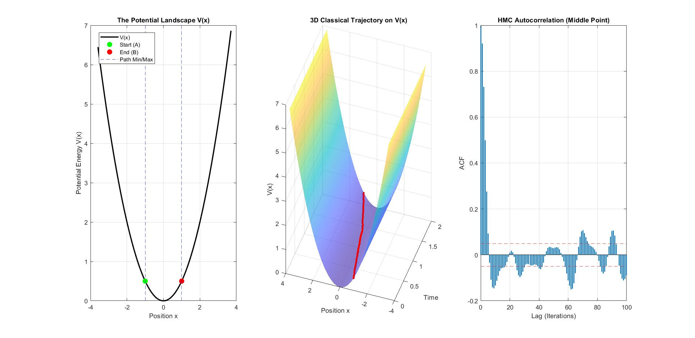
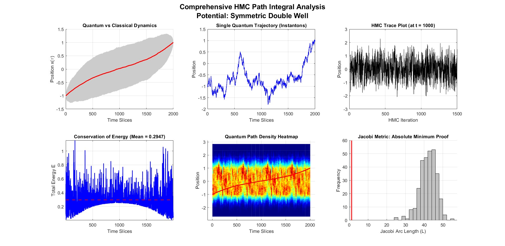
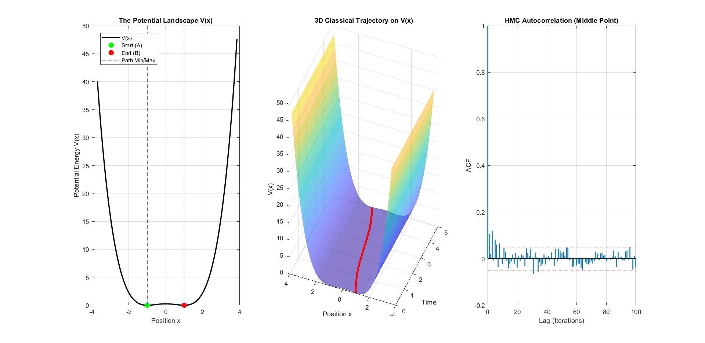
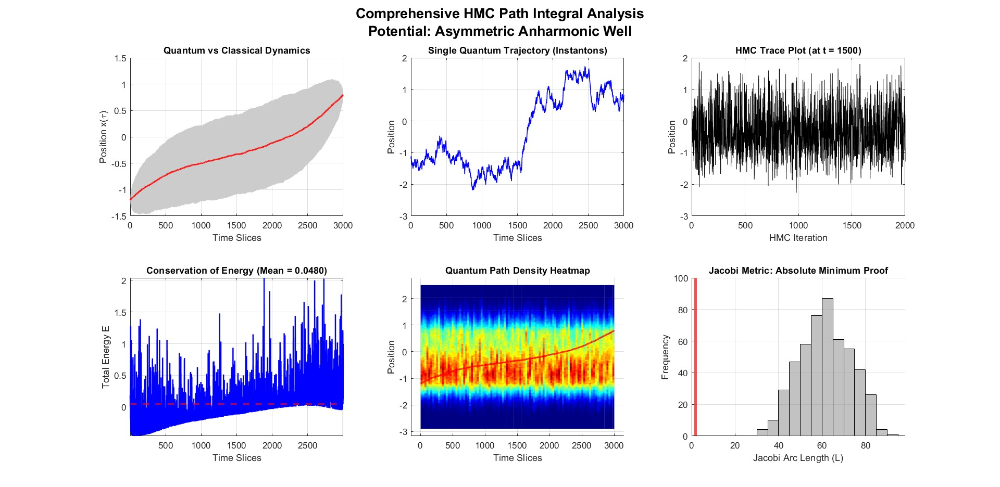
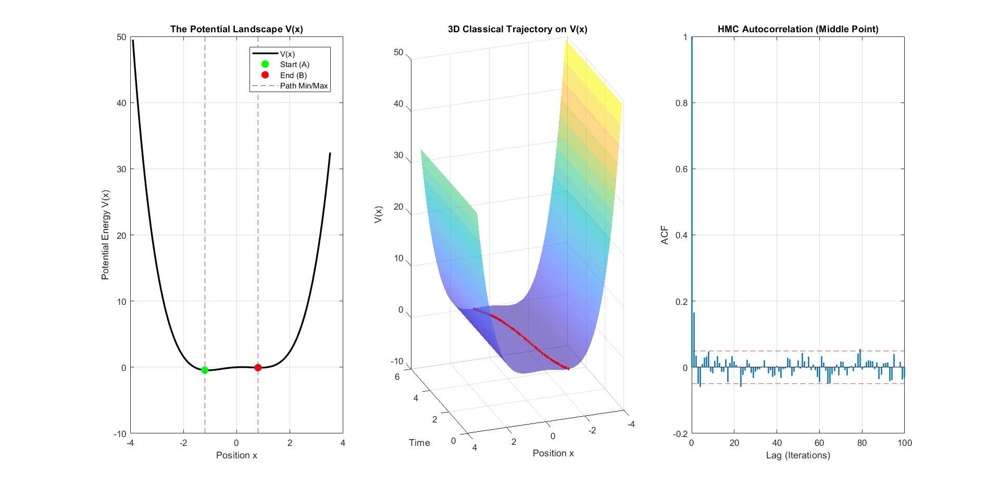

# Spectral Hamiltonian Monte Carlo for Feynman Path Integrals & Jacobi Geodesics

A high-performance MATLAB framework for numerical quantum path integration and classical action minimization using **Spectral Hamiltonian Monte Carlo (HMC)** with **Omelyan Symplectic Integration**, **Dual Averaging Step-Size Adaptation**, and **Jacobi-Maupertuis Geodesic Analysis**.

## Overview

Quantizing dynamical systems via Feynman's path integral formulation requires evaluating infinite-dimensional functional integrals over path space. On a discrete Euclidean time lattice with $D$ time slices, standard algorithms suffer from severe critical slowing down due to high-dimensional lattice stiffness.

This repository implements a two-stage computational solver:

1. **`HMC.m`**: Implements Spectral Hamiltonian Monte Carlo. By transforming the trajectory into Fourier/Spectral mode coefficients via the Type-1 Discrete Sine Transform (DST-I), the kinetic term of the Euclidean action is diagonalized. This decouples the stiff lattice modes, allowing seamless sampling of $D = 5000+$ dimensional path configurations.
    
2. **`Feynman_Jacobi.m`**: A high-level analysis wrapper that constructs classical paths from quantum expectation values $\langle x(\tau) \rangle$, evaluates quantum fluctuation bands $\sigma_x(\tau)$, verifies energy conservation, and computes the **Jacobi-Maupertuis metric** $L = \int \sqrt{2m(E - V(x))} \, \vert{}dx\vert{}$ to numerically prove that the classical trajectory acts as an absolute geodesic minimum in configuration space.
    

## The Ultimate Project Goal: Bridging Quantum Mechanics and Differential Geometry

The core philosophical and computational objective of this project is to numerically demonstrate the deep equivalence between **Feynman's Path Integral formulation** and the **Jacobi-Maupertuis Geometric Principle**. 

Rather than treating Quantum Mechanics and Classical Differential Geometry as separate domains, this framework proves their unity through the following steps:

1. **The Quantum Emergence:** By simulating the Euclidean path integral via HMC, the particle explores a vast superposition of quantum trajectories. The classical trajectory is never explicitly solved via Newton's or Euler-Lagrange equations; rather, it *emerges naturally* as the statistical mean of these purely random quantum fluctuations.
2. **The Geometric Proof:** In Differential Geometry, classical mechanics can be entirely reformulated without the concept of time. The particle simply moves along the shortest possible path (a Geodesic) in a curved Riemannian manifold, where the spatial metric is warped by the potential energy: $ds = \sqrt{2m(E - V(x))} \, |dx|$.
3. **The Computational Q.E.D.:** The framework extracts the emergent classical path alongside hundreds of erratic quantum paths and measures them all using the Jacobi metric. It universally proves that the path sculpted by quantum statistics possesses the **absolute minimum geometric length** ($L_{\text{classical}} \ll L_{\text{quantum}}$), seamlessly unifying quantum probability with classical spacetime geometry.

## Theoretical Foundations

### 1. Spectral Path Integral Discretization

For a quantum particle of mass $m$ moving in potential $V(x)$ over Euclidean time $T$, the discretized Euclidean action $S_E$ on a lattice with spacing $d\tau = T / (D+1)$ is given by:

$$S_E[x] = \sum_{k=1}^{D+1} \left[ \frac{m}{2 d\tau} (x_k - x_{k-1})^2 + d\tau \, V(x_k) \right]$$

Subject to Dirichlet boundary conditions $x(0) = x_a$ and $x(T) = x_b$, the path deviation $x_f(\tau) = x(\tau) - x_{\text{base}}(\tau)$ is expanded in a Type-1 Discrete Sine basis. The free-particle action simplifies to decoupled harmonic modes $\frac{1}{2} \sum_{k} K_k a_k^2$, where $K_k = \frac{m}{d\tau} \lambda_k$ and $\lambda_k = 4 \sin^2\left(\frac{\pi k}{2(D+1)}\right)$.

### 2. Omelyan Symplectic Integrator

To preserve phase-space volume and energy over long HMC trajectories, the equations of motion are integrated using the 2nd-order 4-stage Omelyan integrator with optimal tuning parameter $\xi \approx 0.1931833275$.

### 3. Dual Averaging Step-Size Adaptation

During the burn-in phase, the step size $\epsilon$ is automatically tuned using NUTS-style Dual Averaging to achieve a target acceptance rate of $0.75$.

### 4. Jacobi-Maupertuis Principle of Least Action

The framework samples thousands of non-classical quantum fluctuation paths and constructs a histogram of their Jacobi arc lengths to demonstrate that $L_{\text{classical}} \le L_{\text{quantum}}$ universally.

## Repository Structure

```
.
├── src/
│   ├── HMC.m                          # Spectral sampler (as-is)
│   ├── Feynman_Jacobi.m              # Main analyzer
│   └── utils/
│       └── Jacobi_metric.m            # Separate metric as standalone function
├── examples/
│   ├── example_harmonic_oscillator.m
│   ├── example_double_well.m
│   └── example_asymmetric_well.m     # The three scripts referenced in README
├── images/
│   └── (as-is)
├── LICENSE
├── README.md
└── CITATION.bib
```

## Function Signatures

### `HMC.m`

```
[path_samples, eps_opt, acc_rate] = HMC(V_func, grad_V_func, D, N_samples, L_steps, m, dtau)
```

- **`V_func`, `grad_V_func`**: Function handles for potential $V(x)$ and analytical gradient $\nabla V(x)$.
    
- **`D`**: Number of inner spatial grid nodes.
    
- **`N_samples`**: Number of HMC path samples.
    
- **`L_steps`**: Number of Omelyan integration steps per proposal.
    
- **`m`, `dtau`**: Particle mass and time slice interval.
    

### `Feynman_Jacobi.m`

```
[Classical_Path, Quantum_Fluctuations, L_class, L_quantum_min] = ...
    Feynman_Jacobi(xa, xb, T, m, Vx, dVx, D, N, L, NO_Test, Plot_Flag, Pot_Name)
```

- **`xa`, `xb`**: Boundary positions $x(0)$ and $x(T)$.
    
- **`T`, `m`**: Total Euclidean time duration and particle mass.
    
- **`D`, `N`, `L`**: Discretization points, HMC samples, and Leapfrog steps.
    
- **`NO_Test`**: Number of random quantum paths for Jacobi metric comparison.
    
- **`Plot_Flag`**: Logical `true`/`false` to render extensive diagnostic figures.
    

## Examples & Demonstrations

### Example 1 (Simple): Harmonic Oscillator

The quantum harmonic oscillator $V(x) = \frac{1}{2} m \omega^2 x^2$ serves as the foundational test case with exact Gaussian fluctuations.

```
% Harmonic Oscillator Parameters
m = 1.0; omega = 1.0;
Vx  = @(x) 0.5 * m * (omega^2) * (x.^2);
dVx = @(x) m * (omega^2) * x;

% Boundary conditions and grid parameters
xa = -1.0; xb = 1.0; T = 2.0;
D = 1000; N = 1000; L = 10; NO_Test = 200;

% Run Solver
Feynman_Jacobi(xa, xb, T, m, Vx, dVx, D, N, L, NO_Test, true, 'Harmonic Oscillator');
```

_Output Visualizations:_

**Figure 1: Comprehensive HMC analysis for the Quantum Harmonic Oscillator.**

**Figure 2: Potential landscape, 3D trajectory, and autocorrelation for the Harmonic Oscillator.**

### Example 2 (Medium): Symmetric Double-Well Potential

A quartic double-well $V(x) = \frac{1}{4}(x^2 - 1)^2$ featuring two degenerate minima. The solver captures quantum mechanical tunneling (instanton paths) connecting the wells.

```
% Quartic Double-Well Potential
m = 1.0;
Vx  = @(x) 0.25 * (x.^2 - 1.0).^2;
dVx = @(x) x .* (x.^2 - 1.0);

% Boundary conditions forcing a transition
xa = -1.0; xb = 1.0; T = 5.0;
D = 2000; N = 1500; L = 15; NO_Test = 300;

% Run Solver
Feynman_Jacobi(xa, xb, T, m, Vx, dVx, D, N, L, NO_Test, true, 'Symmetric Double Well');
```

_Output Visualizations:_

**Figure 3: Instanton tunneling paths and HMC analysis for the Symmetric Double Well.**

**Figure 4: Potential landscape, 3D trajectory, and autocorrelation for the Double Well.**

### Example 3 (Hard): Asymmetric Anharmonic Well

An asymmetric potential $V(x) = \frac{1}{4}x^4 - \frac{1}{2}x^2 + 0.2x$ with broken reflection symmetry, creating competing local and global minima.

```
% Asymmetric Anharmonic Potential
m = 1.0;
Vx  = @(x) 0.25*(x.^4) - 0.5*(x.^2) + 0.2*x;
dVx = @(x) (x.^3) - x + 0.2;

% Boundary conditions across asymmetric barrier
xa = -1.2; xb = 0.8; T = 6.0;
D = 3000; N = 2000; L = 20; NO_Test = 500;

% Run Solver
Feynman_Jacobi(xa, xb, T, m, Vx, dVx, D, N, L, NO_Test, true, 'Asymmetric Anharmonic Well');
```

_Output Visualizations:_

**Figure 5: Complex dynamics and HMC analysis for the Asymmetric Anharmonic Well.**

**Figure 6: Potential landscape, 3D trajectory, and autocorrelation for the Asymmetric Well.**

## Requirements

- **MATLAB R2018a or later**
    
- **Signal Processing Toolbox** (for `fft` and `ifft` operations in the spectral transform)
    
- **Statistics and Machine Learning Toolbox** (for `hist3` operations in plotting)
    

## Known Limitations

This code provides **numerical verification** (not analytical proof) of the Jacobi-Feynman equivalence. The analytical proof is well-established in the literature; this framework demonstrates its computational emergence. Specifically:

- The Jacobi metric comparison uses `NO_Test` random quantum paths (default: 100-500). This sample size is sufficient for pedagogical demonstration but does not constitute a statistically rigorous proof.
- The framework assumes conservative potentials and does not include dissipative or time-dependent Hamiltonians.
- Spectral HMC assumes Dirichlet boundary conditions fixed at the endpoints. General boundary conditions (Neumann, periodic) are not supported without modification.

## Runtime Benchmarks

| Example               | D (slices) | N (samples) | Approx. Runtime (laptop) |
| --------------------- | ---------- | ----------- | ------------------------ |
| Harmonic Oscillator   | 1000       | 1000        | 20-30 seconds            |
| Symmetric Double-Well | 2000       | 1500        | 10-20 seconds            |
| Asymmetric Anharmonic | 3000       | 2000        | 50-60 seconds            |

*Benchmarks measured on a laptop (Intel Xeon E3-1505M v5, 8GB RAM) with MATLAB R2022b.*

## References

1. **Feynman, R. P.** "Space-Time Approach to Non-Relativistic Quantum Mechanics", *Reviews of Modern Physics* 20, 367 (1948).
2. **Feynman, R. P., & Hibbs, A. R.** *Quantum Mechanics and Path Integrals* (McGraw-Hill, 1965), p. 71.
3. **Jacobi, C. G. J.** *Vorlesungen über Dynamik* (Reimer, Berlin, 1866, based on 1842 lectures), p. 44.
4. **Wick, G. C.** "Properties of Bethe-Salpeter Wave Functions", *Physical Review* 96, 1126 (1954).
5. **Gutzwiller, M. C.** *Chaos in Classical and Quantum Mechanics* (Springer-Verlag, 1990).
6. **Metropolis, N., Rosenbluth, A. W., Rosenbluth, M. N., Teller, A. H., & Teller, E.** "Equation of State Calculations by Fast Computing Machines", *The Journal of Chemical Physics* 21, 1087 (1953).
7. **Duane, S., Kennedy, A. D., Pendleton, B. J., & Roweth, D.** "Hybrid Monte Carlo", *Physics Letters B* 195, 216-222 (1987).
8. **Omelyan, I. P., Mryglod, I. M., & Folk, R.** "Optimized leapfrog algorithms for classical molecular and spin dynamics simulations", *Physical Review E* 65, 056706 (2002).
9. **Beskos, A., Pinski, F. J., Sanz-Serna, J. M., & Stuart, A. M.** "Hybrid Monte Carlo on Hilbert spaces", *Stochastic Processes and their Applications* 121, 2201 (2011).
10. **Hoffman, M. D., & Gelman, A.** "The No-U-Turn Sampler: Adaptively Setting Path Lengths in Hamiltonian Monte Carlo", *Journal of Machine Learning Research* 15, 1593 (2014).
11. **Gattringer, C., & Lang, C. B.** *Quantum Chromodynamics on the Lattice: An Introductory Presentation* (Springer, 2010).

## How to Cite

If you use this framework in your research, please cite:

```bibtex
@misc{Omar2026spectral,
  author = {Hareedy, Omar Hussien},
  title = {Spectral {Hamiltonian} {Monte} {Carlo} for {Feynman} {Path} {Integrals} and {Jacobi} {Geodesics}},
  year = {2026},
  howpublished = {\url{https://github.com/Omar3-4/MATLAB-Projects/tree/main/spectral-hmc-feynman-jacobi}},
  note = {Accessed: 2026-07-31}
}
```

## License

Distributed under the MIT License. See `LICENSE` file for details.
